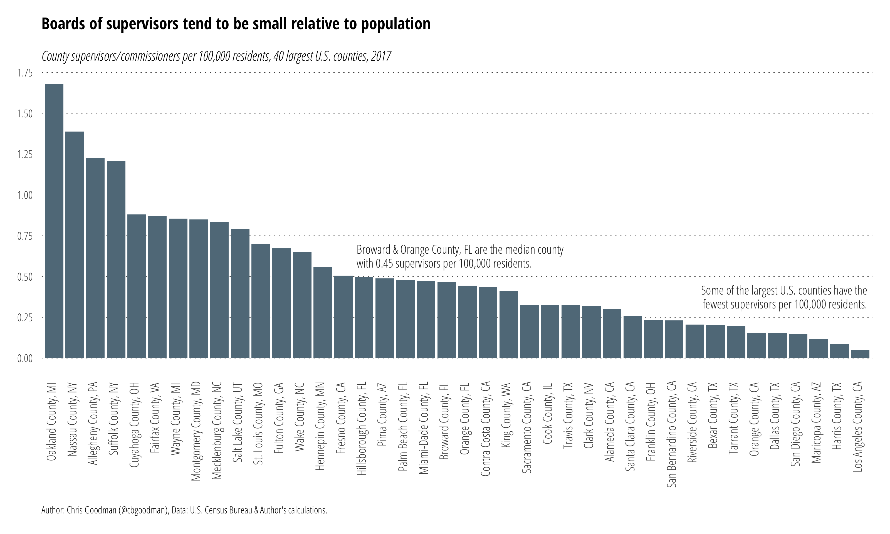

# County Commissioners/Supervisors per 100,000 Residents

The **R** script `supervisors.r` reads `county.csv` to create the image below of county commission/board of supervisor members per 100,000 residents for the 40 largest U.S. counties in 2017. Population data is from the 2017 U.S. Census Bureau population estimates and council data are collected by [me](http://www.github.com/cbgoodman) from county government websites.

